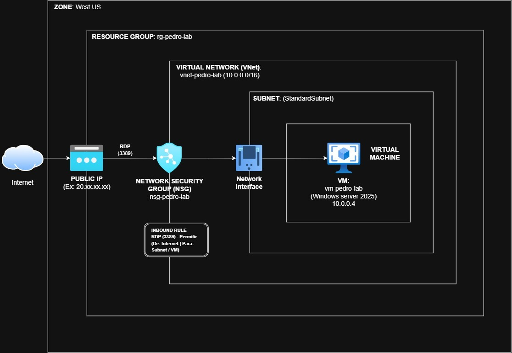
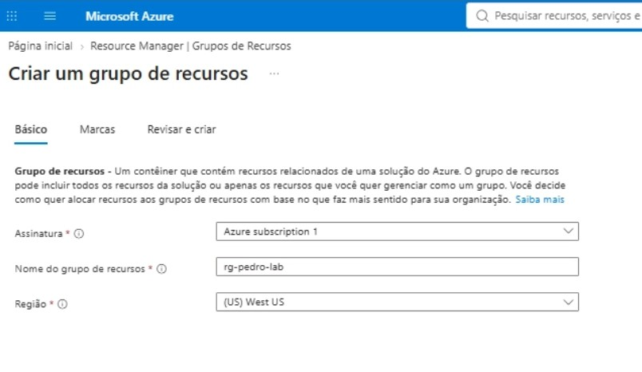
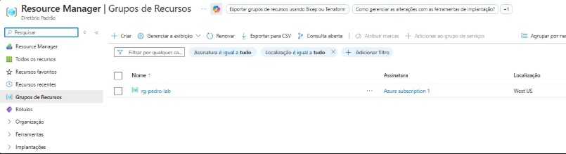
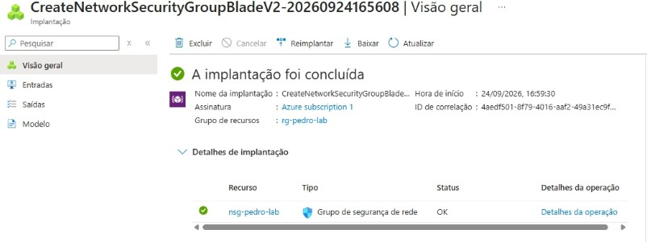
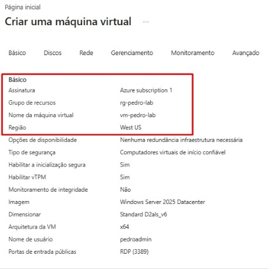
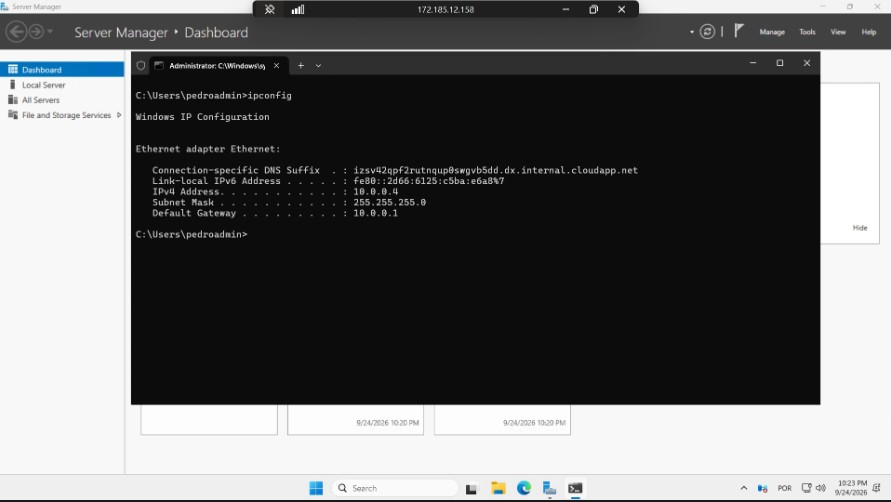

# Lab 01: Base Infrastructure Deployment (VNet, NSG, and VM)

## 🎯 Objective
Deploy a foundational and secure infrastructure on Microsoft Azure. This lab demonstrates the creation of a Resource Group, a Virtual Network (VNet) with isolated subnets, a Network Security Group (NSG) for traffic filtering, and a Virtual Machine running Windows Server 2025.

## 📐 Architecture Diagram
 

## 🛠️ Components Created
- **Resource Group:** `rg-pedro-lab` deployed in the **West US** region.
- **Virtual Network (VNet):** `vnet-pedro-lab`[cite: 1].
- **Network Security Group (NSG):** `nsg-pedro-lab`[cite: 2].
- **Virtual Machine:** `vm-pedro-lab` running **Windows Server 2025 Datacenter**.
  
## 🚀 Deployment Steps & Validation

### 1. Resource Group & Virtual Network
First, the Resource Group was created to logically group the resources, followed by the provisioning of the VNet to ensure network isolation.
  

### 2. Network Security Group (NSG)
An NSG was deployed to act as a virtual firewall, explicitly allowing inbound traffic on port **3389 (RDP)** so the virtual machine could be accessed remotely.
  

### 3. Virtual Machine Provisioning
The Virtual Machine was created using the Windows Server 2025 Datacenter image and the Standard D2als_v6 size, and attached to the previously created VNet and NSG.
  

### 4. Remote Access & Validation
Finally, the environment was validated by accessing the VM via RDP. Commands such as `ipconfig` were executed in the Command Prompt to verify the OS details and confirm the internal IP configuration (10.0.0.4).
  

